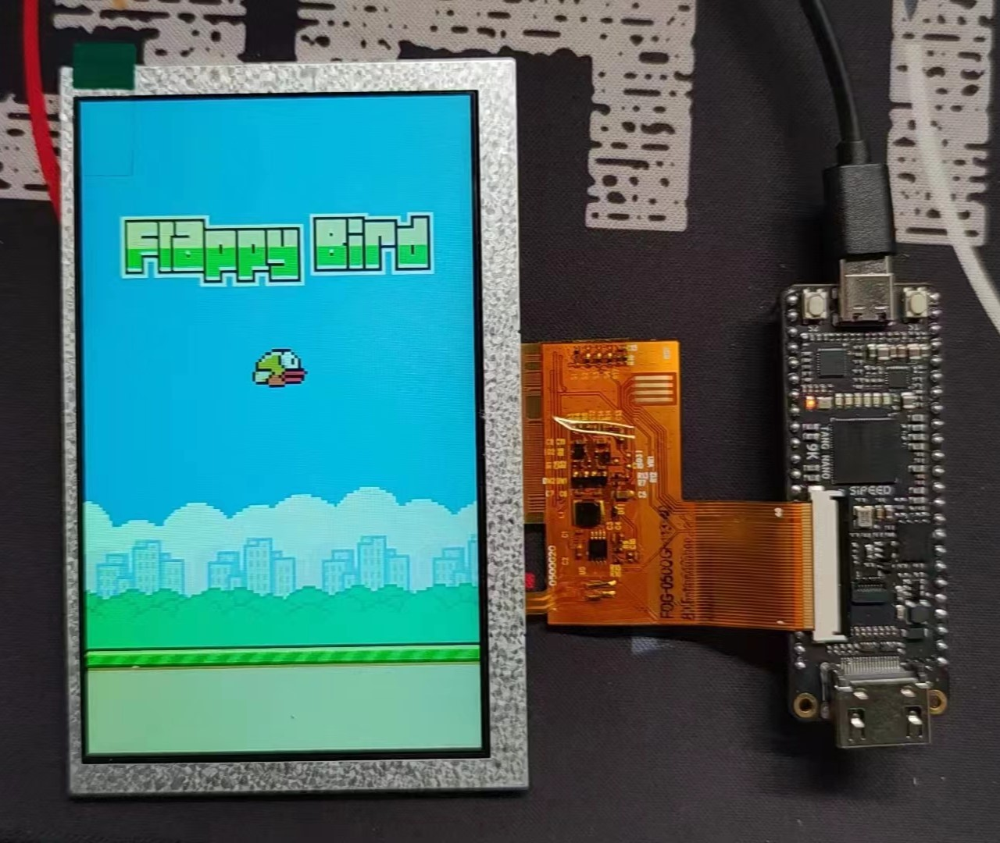

# Flappy Bird on FPGA

## Requirements
* For FPGA: [TANG Nano 9K](https://wiki.sipeed.com/hardware/en/tang/Tang-Nano-9K/Nano-9K.html) based on Gowin GW1NR-9 FPGA chip. Also use a 5-inch RGB LCD screen, 800*480 pixels.
* For Simulation: Verilator with SDL on Linux. 

## 需求
* FPGA：这个项目使用 Sipeed 出品的 [TANG Nano 9K](https://wiki.sipeed.com/hardware/en/tang/Tang-Nano-9K/Nano-9K.html)，基于高云半导体的 GW1NR-9 FPGA 芯片，价格不贵。此外还使用了一块 5 寸 RGB LCD 屏幕，800*480 像素。
* 仿真：使用 Linux 环境下的 Verilator 配合 SDL 图形库进行仿真，仅用于早期开发和调试，性能拉跨。

## Simulation Guide 仿真指南
You need to install verilator and SDL library. Please refer to their document.

你需要安装 Verilator 和 SDL 库，请参考他们的文档。

Project provides a Makefile to compile and build automatically. To generate waveform, please remove comment sign before `#define TRACE_WAVE` in file `src_sim\main.cpp`.
```
make            # Build and run simulation
make wave       # View waveform
make clean      # Clean simulation temp files
```

项目提供了一个 Makefile 文件来自动化编译和构建。要生成波形，请取消掉 `src_sim\main.cpp` 中 `#define TRACE_WAVE` 的注释。
```
make            # 构建并运行仿真
make wave       # 查看波形
make clean      # 清除仿真临时文件
```

## Run on FPGA Board 在 FPGA 开发板上运行
Open `flappy-bird-fpga.gprj` file in Gowin IDE and run all processes. Using Gowin Program Tool to download bitstream.

用高云云源软件打开工程文件 `flappy-bird-fpga.gprj`，运行所有步骤并使用高云下载器烧录比特流文件到开发板。

## Gallery 画廊


## References 参考资料
* [Exploring FPGA Graphics - Project F: FPGA Dev](https://projectf.io/posts/fpga-graphics/)
* [Beginning Game Programming v2.0 - Lazy Foo' Productions](https://lazyfoo.net/tutorials/SDL/)
* [ben7th/flappy-html5-bird](https://github.com/ben7th/flappy-html5-bird)

## License
MIT LICENSE for codes.
